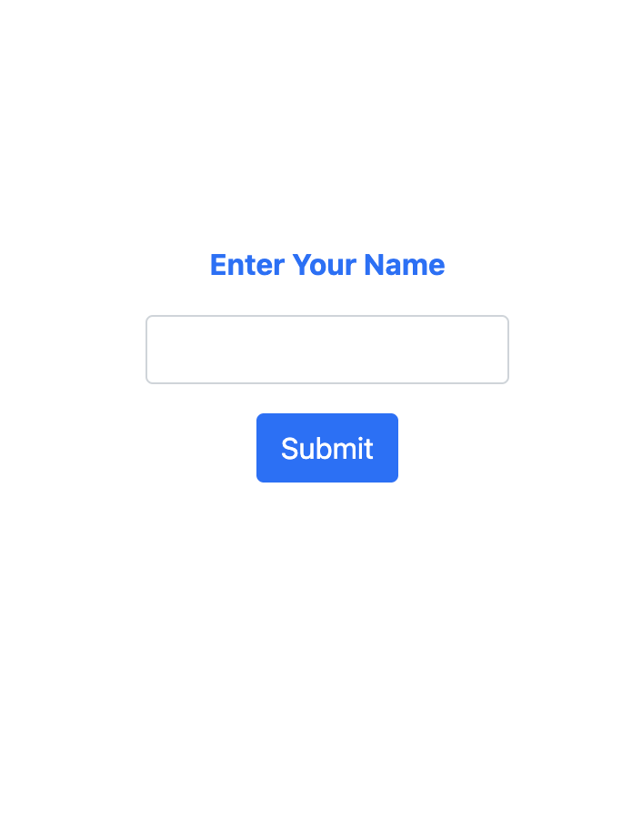
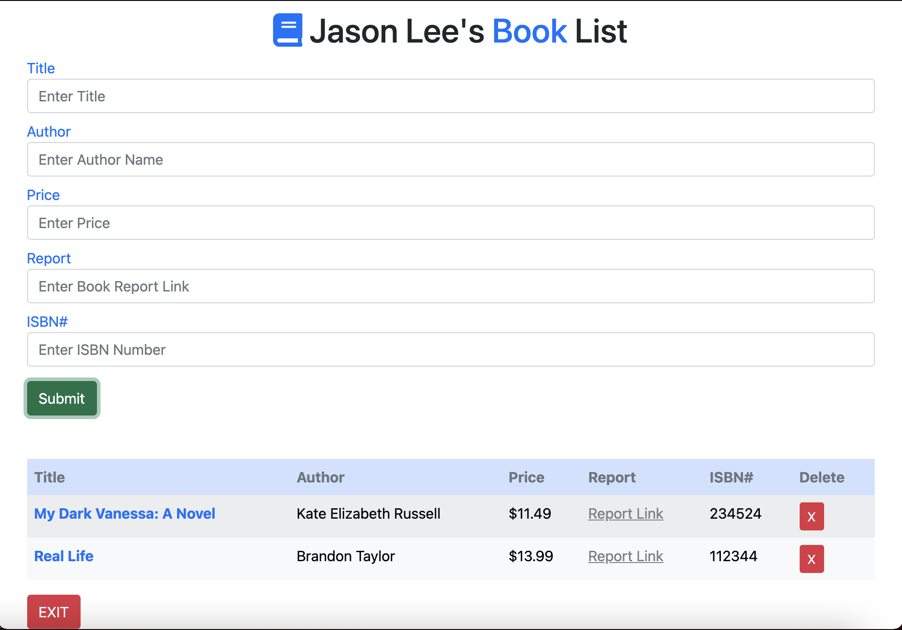

# Store your books!

### Link: https://jasonlee-cp.github.io/book-list/

This is book-list app made by **Vanila Javascript** and **Bootstrap**. You can write (title/author/price/book/record URL(blog etc)/ISBN#) to store your book data.

Below is the **front page** where you can enter name. This will be stored in the local Storage so that you can use later after closing tab.

Below is the **main page**.

